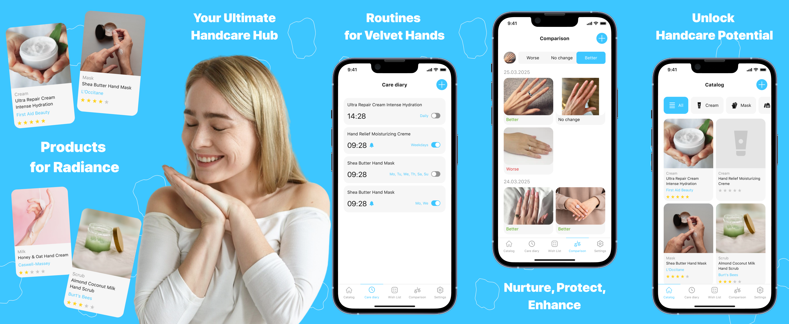
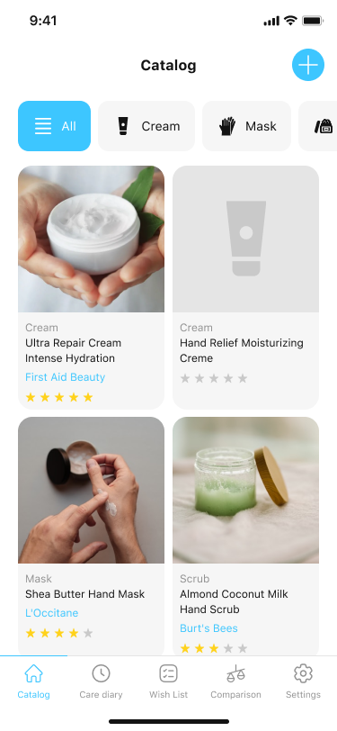
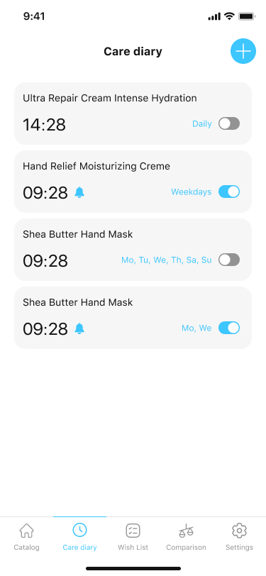
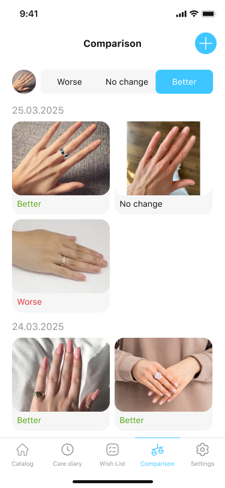

# Velvet Hands: Opal Flow

**Velvet Hands** is a Flutter app that helps you care for your hands with elegance and ease. Track your daily skincare, set personalized reminders, organize cosmetic products, monitor visual results, and build your wish list — all in one beautiful interface.



## 🛠️ Technologies

- **Flutter** and **Dart**
- **Provider** — state management
- **Hive** — local storage for care plans, reminders, and photos
- **Flutter ScreenUtil** — responsive UI
- **Local notifications** — smart reminders for care routines
- **Custom components** — product rating, date filters, comparison gallery

## 📱 Screenshots

| Catalog | Care Diary with Reminders | Progress Comparison |
|---------|----------------------------|----------------------|
|  |  |  |

## 🚀 How to Run

1. Clone the repo
   ```sh
   git clone https://github.com/NMMustafina/velvet_hands_opal_flow.git
   ```
2. Install all the packages by typing the following command
   ```sh
   flutter pub get
   ```
3. Run the App
